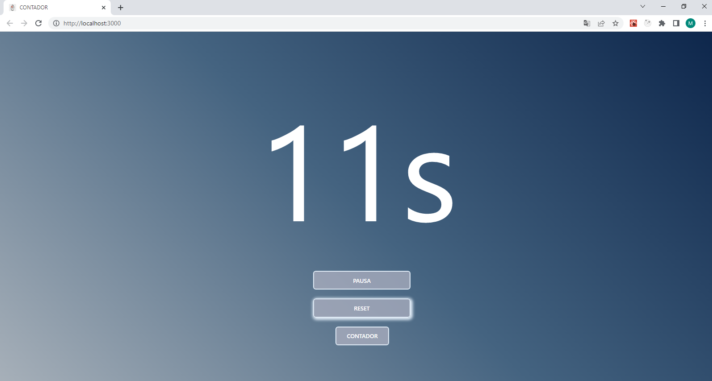
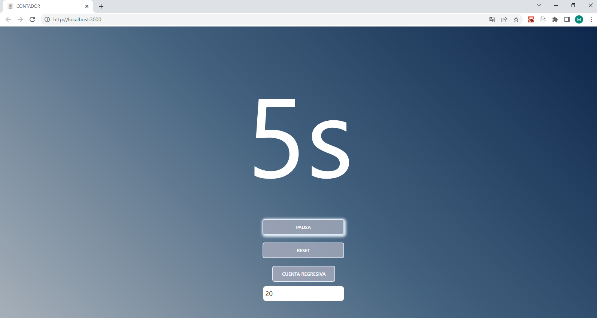

## React Hooks Timer App

Haremos una App sencilla, utilizando los nuevos features de React, __Hooks__, que nos permiten el uso de manejos de estados y llevar a cabo efectos secundarios en nuestros componentes funcionales.

Nuestra App sera un Contador y Cuenta regresiva. Podremos cambiar entre ambos y escribir una cantidad de segundos para la cuentra regresiva.

Tendremos un solo componente en donde manejaremos los estados y nuestra UI. 

Ejecutamos `npm install` en la consola para instalar las dependencias, una vez instaladas inicializamos el proyecto con `npm start`. Se iniciara en `http://localhost:3000/`.

       
    
       
    

